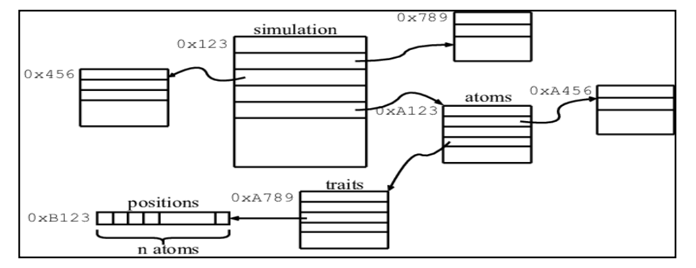

# 1. Giriş
Bu rapor, veritabanı sistemlerinde kullanılan pointer zinciri veri erişim tekniğini tanımlamaktadır. Pointer zinciri, veri erişimini optimize etmek ve ilgili tablolar arasındaki veri ilişkilerini etkili bir şekilde yönetmek için kullanılan bir yöntemdir. Bu raporda, pointer zinciri veri erişim tekniğinin işleyişini bir örnekle açıklayarak, bu tekniğin veritabanı sistemlerindeki önemini vurgulamaktadır.
Veritabanları genellikle karmaşık veri yapıları içeren sistemlerdir ve verilerin verimli bir şekilde yönetimi ve erişimi hayati öneme sahiptir. Pointer zinciri veri erişim tekniği, farklı tablolardaki veriler arasında ilişkiler kurarak veri erişimini kolaylaştırır ve sorgu işlemlerini optimize eder.
Bu yöntem, özellikle ilişkisel veritabanlarından veri almak ve bu veriler arasında gezinmek gerektiğinde yaygın olarak kullanılmaktadır. Raporun sonraki bölümlerinde, pointer zinciri veri erişim tekniğinin daha ince detaylarına değinecek, örnekler sunacak ve literatürdeki yerine bakacağız.

# 2. Veritabanında Pointer Zinciri Veri Erişim Tekniği
Pointer zinciri, bellekteki veriye erişmek için birbirine bağlı pointer'ların (göstericiler) kullanıldığı bir programlama terimidir. Bu, pointer'ların birbirine bağlandığı ve dolaylı olarak verilere erişim sağladığı bir veri yapısıdır.
Örneğin, bir restorana gittiğinizi ve garsondan sipariş verdiğinizi hayal edin. Garson, siparişinizi kaydetmek ve mutfağa iletmek için bir pointer zinciri kullanabilir. Bu pointer, sipariş ve müşteri bilgilerini temsil eder ve mutfak bölümüne gönderilir. Şef, bu pointer'ı kullanarak siparişi hazırlar. Sipariş hazırlandığında, pointer sonraki adıma yönlendirilir, örneğin servis bölümüne gönderilir ve garson doğru siparişi zinciri takip ederek alır ve müşteriye servis eder.
Yukarıdaki örnekte gösterildiği gibi, bir dizi içindeki elemanlara pointer zinciri kullanarak erişebilirsiniz. İlk pointer, dizinin ilk elemanını işaret eder ve sonraki pointer'lar diğer elemanlara erişmek için kullanılır. Bu şekilde, zincirleme pointer'lar dizi içindeki verilere erişmek için kullanılır.
Pointer zinciri tekniği, özellikle karmaşık veri yapılarının olduğu veya ilgili verileri izleme gereksiniminin olduğu durumlarda yaygın olarak kullanılmaktadır, veritabanı sistemleri gibi. Pointer zinciri, veriler arasındaki bağlantıları temsil etmek ve takip etmek için etkili bir araç sağlar.
Veritabanları genellikle büyük miktarda veri içerir ve bu verilere hızlı ve verimli bir şekilde erişmek çok önemlidir. Pointer zinciri veri erişim tekniği, bir veritabanındaki verilere erişmek için kullanılan bir yöntemdir. Bu teknikte, pointer'lar bellek adreslerini işaret eden değişkenlerdir. Bir pointer başka bir pointer'ı işaret ettiğinde ve bu pointer da başka bir pointer'ı işaret ettiğinde zincir oluşur.
Pointer zinciri veri erişim tekniği, veritabanında karmaşık ve ilişkili veri yapılarının olduğu durumlarda yaygın olarak kullanılır. Bu teknik, verilerin fiziksel depolama konumlarına bakılmaksızın verilere erişimi mümkün kılar. Veritabanındaki veriler fiziksel olarak farklı bloklara dağıtılabilir, ancak pointer zinciri bu bloklara erişimi basitleştirir.
Ancak, pointer zinciri veri erişim tekniğinin bazı dezavantajları olabilir. Örneğin, zincirdeki her bir bağlantı ayrı bir disk erişimi gerektirir, bu da performansı etkileyebilir. Ayrıca, zincir kırılırsa veya bozulursa, veri erişiminde sorunlara yol açabilir. Bu nedenle, veritabanı yönetim sistemleri, bu teknikle birlikte uygun hata kontrolü ve veri bütünlüğü mekanizmaları sağlar.

Pointer zinciri veri erişimi, veritabanlarındaki verilere daha hızlı ve verimli erişim sağlamak için kullanılan bir tekniktir. Pointer zinciri aracılığıyla veriler arasındaki ilişkileri takip eder ve veriye erişimi hızlandırır.

## Avantajları:
- **Esneklik:** Veriler arasındaki ilişkileri esnek bir şekilde temsil eder.
- **Veri Bağlantılarını İzleme:** İlgili verilere erişmek için pointer'ların izlenmesini sağlar.
- **Bellek Verimliliği:** Gerçek veri yerine pointer kullanarak bellek kullanımını optimize eder.

## Dezavantajları:
- **Hatalara Duyarlılık:** Yanlış pointer kullanımı veya zincirin yanlış izlenmesi hatalara yol açabilir.
- **Karmaşıklık:** Karmaşık veri yapıları veya ilişkiler olduğunda kod karmaşıklığını artırabilir.
- **Bellek Sorunları:** Yanlış pointer kullanımı veya hatalı referanslar bellek hatalarına neden olabilir.

Örneğin, bir e-ticaret platformunun veritabanında iki tablo olduğunu varsayalım: "Ürünler" ve "Siparişler."

### "Ürünler" Tablosu:
| Ürün ID | Ürün Adı   | Fiyat  |
|---------|------------|--------|
| 1       | Telefon    | 1000   |
| 2       | Bilgisayar | 2000   |
| 3       | Televizyon | 1500   |

### "Siparişler" Tablosu:
| Sipariş ID | Müşteri ID | Ürün ID |
|------------|------------|---------|
| 101        | 1          | 2       |
| 102        | 2          | 1       |
| 103        | 1          | 3       |

Bu senaryoda, "Siparişler" tablosu, "Ürünler" tablosunu işaret eden bir pointer içerir.

Sipariş ID'si 101 olan bir siparişin ürün bilgilerine erişmek istediğinizi varsayalım.
"Siparişler" tablosunda Sipariş ID'si 101 olan satıra gidin ve ilgili "Ürün ID" alanını kontrol edin. Bu alan, "Ürünler" tablosundaki ilgili ürüne işaret eden bir değeri içermelidir.
Pointer'ı takip ederek, ilgili ürünün bilgilerine erişebilirsiniz. Bu durumda, Ürün ID'si 2 olan ürünü, yani "Bilgisayar"ı elde edersiniz.

Bu örnekte, pointer zinciri veri erişim tekniği, siparişlerle ilişkili ürünlere erişmek için kullanılmıştır. Benzer şekilde, diğer siparişlerin ve ilgili ürünlerin bilgilerine erişmek için aynı yöntemi uygulayabilirsiniz.

Bu örnekte, pointer zinciri, birbirini işaret eden pointer'ların zincirleme bir şekilde oluşturulmasını ifade eder ve bu zinciri takip ederek meyve isimlerine erişim sağlar.
Örneğin, bir meyve sepetinde çeşitli meyvelerin olduğunu ve bu meyveler arasında ilişkiler bulunduğunu varsayalım. Her bir meyve, sepetteki bir sonraki meyveyi işaret eden bir pointer içerir. Örneğin, bir elma sepetinde elmalar, armutlar, portakallar ve çilekler vardır. Elma pointer'ı sepetteki bir sonraki meyve olan armudu işaret eder. Armut pointer'ı ise bir portakalı işaret eder ve zincir böyle devam eder.

Bu pointer zinciri, meyvelerin birbirine bağlı olduğunu ve bu bağlantıları takip ederek meyve isimlerine erişebileceğimizi gösterir.
